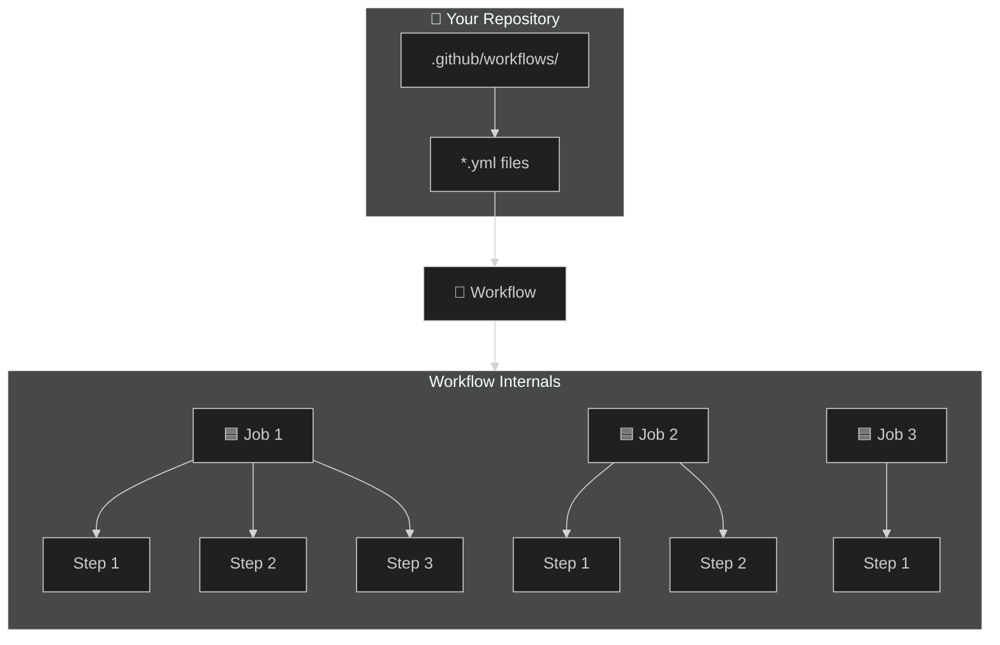
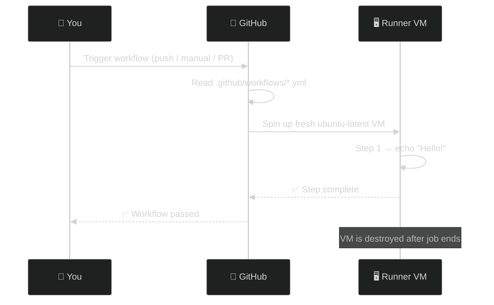

# 01 · Workflow Fundamentals

> **The building block of everything in GitHub Actions.**

---

## 🔍 The Big Picture



---

## 🧬 Hierarchy — 3 Levels

```
┌──────────────────────────────────────────────┐
│  WORKFLOW  (.yml file)                       │
│  ┌────────────────────────────────────────┐  │
│  │  JOB  (runs on a fresh VM)             │  │
│  │  ┌──────────────────────────────────┐  │  │
│  │  │  STEP 1  →  STEP 2  →  STEP 3   │   │  │
│  │  └──────────────────────────────────┘  │  │
│  └────────────────────────────────────────┘  │
│  ┌────────────────────────────────────────┐  │
│  │  JOB  (runs on a DIFFERENT fresh VM)   │  │
│  │  ┌──────────────────────────────────┐  │  │
│  │  │  STEP 1  →  STEP 2               │  │  │
│  │  └──────────────────────────────────┘  │  │
│  └────────────────────────────────────────┘  │
└──────────────────────────────────────────────┘
```

### Key Rules

| Concept | Rule |
|---------|------|
| **Workflow** | Triggered by an event (push, PR, manual, cron) |
| **Job** | Runs on its own **fresh VM** — jobs are isolated |
| **Step** | Runs **sequentially** inside a job — shares the same VM |
| Jobs | Run in **parallel** by default |
| Steps | Run **one after another** — always sequential |

---

## 📝 Anatomy of a Workflow File

```yaml
# ──────────────────────────────────────
# 1️⃣ WORKFLOW level
# ──────────────────────────────────────
name: My First Workflow         # 👈 Display name in GitHub UI

on:                              # 👈 What triggers this workflow?
  workflow_dispatch:             #    Manual trigger from Actions tab

# ──────────────────────────────────────
# 2️⃣ JOBS level
# ──────────────────────────────────────
jobs:
  say_hello:                     # 👈 Job ID (you pick this name)
    runs-on: ubuntu-latest       # 👈 What machine to run on

    # ──────────────────────────────────
    # 3️⃣ STEPS level
    # ──────────────────────────────────
    steps:
      - name: Greet the world    # 👈 Step name (shows in logs)
        run: echo "Hello, GitHub Actions! 🚀"
```

---

## ▶️ How It Executes



---

## 🧪 Demo Workflow

📄 **File:** [`.github/workflows/hello-world.yml`](./.github/workflows/hello-world.yml)

### How to test it:
1. Copy the file to your repo's `.github/workflows/` folder
2. Push to GitHub
3. Go to **Actions tab** → select **"01 - Hello World"** → click **"Run workflow"**
4. Watch the logs — you'll see the echo output

---

## ⚠️ Common Pitfalls

| Mistake | Fix |
|---------|-----|
| Wrong indentation | YAML uses **spaces only** (2-space indent) — never tabs |
| File not in `.github/workflows/` | Must be exactly this path |
| Typo in `runs-on` | Must match a valid runner (e.g., `ubuntu-latest`) |
| Missing `on:` trigger | Workflow won't run without a trigger |

---

## 🎯 Try It Yourself

> Modify the demo to add a **second step** that prints the current date using `date` command.

---

[⬅️ Back to Roadmap](../README.md) · [Next: Step Types ➡️](../02-step-types/)
