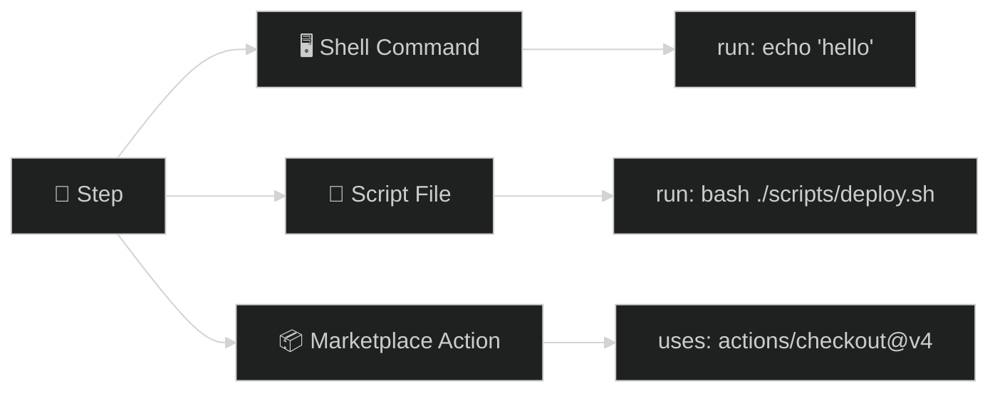
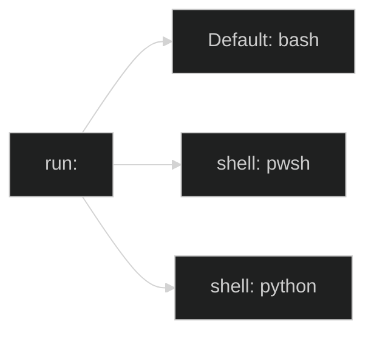
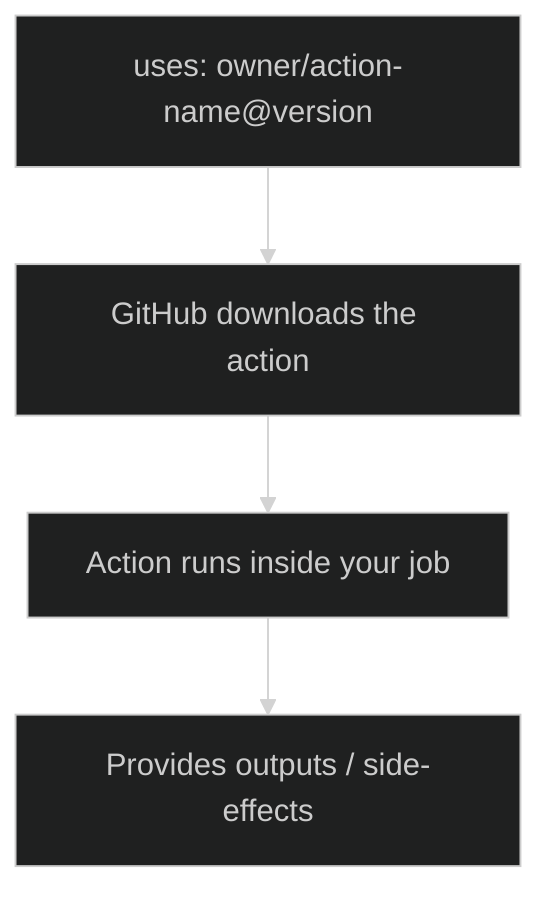
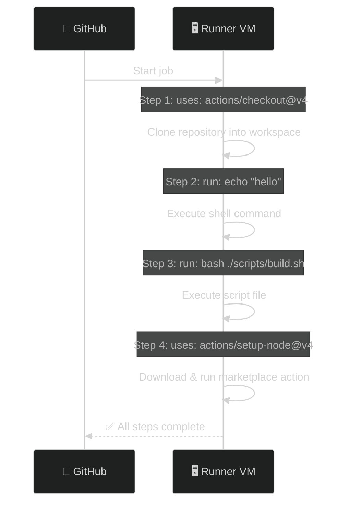

# 02 · Step Types

> **A step can be 3 things: a shell command, a script file, or a marketplace action.**

---

## 🔍 The 3 Types at a Glance



---

## 📊 Comparison

| | Shell Command | Script File | Marketplace Action |
|---|---|---|---|
| **Keyword** | `run:` | `run:` | `uses:` |
| **What it does** | Executes inline command | Runs an external script | Runs pre-built logic from GitHub |
| **Best for** | Quick one-liners | Complex multi-line logic | Standard tasks (checkout, setup, deploy) |
| **Example** | `run: npm test` | `run: bash ./scripts/test.sh` | `uses: actions/setup-node@v4` |

---

## 1️⃣ Shell Command (`run:`)

```yaml
steps:
  # Single line
  - name: Print greeting
    run: echo "Hello!"

  # Multi-line (use pipe |)
  - name: Multiple commands
    run: |
      echo "Step 1: Install"
      npm install
      echo "Step 2: Test"
      npm test
```



> You can change the shell with `shell: pwsh` (PowerShell) or `shell: python`.

---

## 2️⃣ Script File (`run:` with a file path)

```
📁 your-repo/
├── .github/workflows/
│   └── build.yml
└── scripts/
    └── deploy.sh      ← 👈 your script
```

```yaml
steps:
  # ⚠️ MUST checkout first — the VM starts empty!
  - uses: actions/checkout@v4

  - name: Run deploy script
    run: bash ./scripts/deploy.sh
```

> **Why checkout first?** The runner VM starts with an empty workspace. `actions/checkout` clones your repo into it.

---

## 3️⃣ Marketplace Action (`uses:`)



```yaml
steps:
  # Checkout your code
  - uses: actions/checkout@v4

  # Setup Node.js (from GitHub Marketplace)
  - uses: actions/setup-node@v4
    with:                          # 👈 Inputs for the action
      node-version: '20'

  # Install and test
  - run: npm install && npm test
```

### Version pinning formats:

| Format | Example | Meaning |
|--------|---------|---------|
| `@v4` | `actions/checkout@v4` | Major version (recommended) |
| `@v4.1.0` | `actions/checkout@v4.1.0` | Exact version |
| `@main` | `actions/checkout@main` | Branch (⚠️ risky) |
| `@sha` | `actions/checkout@abc123` | Commit SHA (most secure) |

---

## ▶️ Execution Flow



---

## 🧪 Demo Workflows

| File | What it demonstrates |
|------|---------------------|
| [`shell-commands.yml`](./.github/workflows/shell-commands.yml) | Inline commands + multi-line + different shells |
| [`run-script.yml`](./.github/workflows/run-script.yml) | Running an external `.sh` script file |
| [`third-party-action.yml`](./.github/workflows/third-party-action.yml) | Using marketplace actions with `with:` inputs |

---

## ⚠️ Common Pitfalls

| Mistake | Fix |
|---------|-----|
| Using `uses:` and `run:` in the same step | ❌ Not allowed — each step is **one or the other** |
| Forgetting `actions/checkout` before running scripts | The VM starts empty — your code isn't there yet |
| Using `@main` for action versions | Pin to a version tag like `@v4` for stability |

---

[⬅️ Workflow Fundamentals](../01-workflow-fundamentals/) · [Next: Workflow Structure (DAG) ➡️](../03-workflow-structure-dag/)
