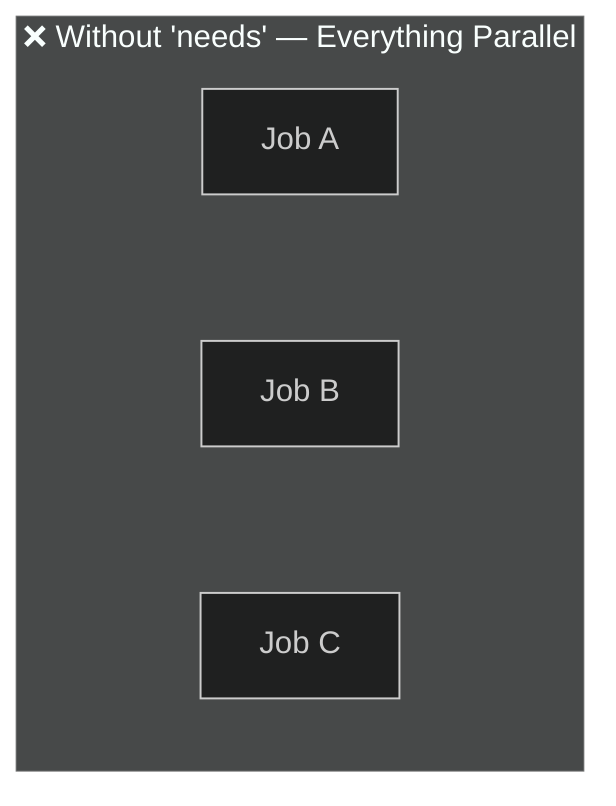
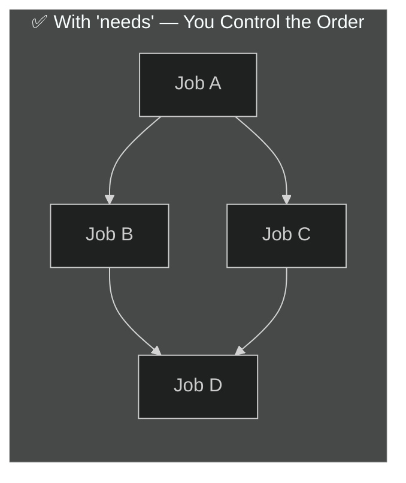
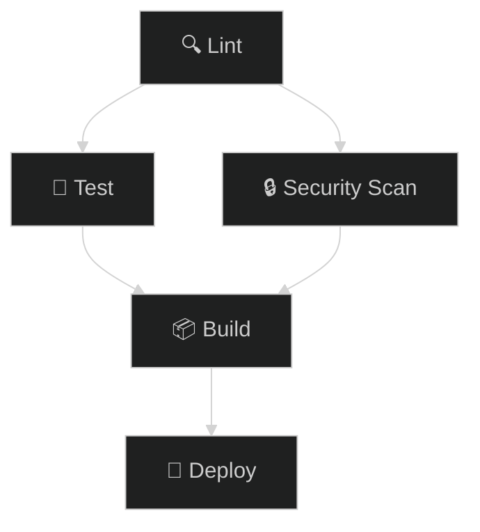
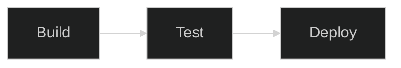
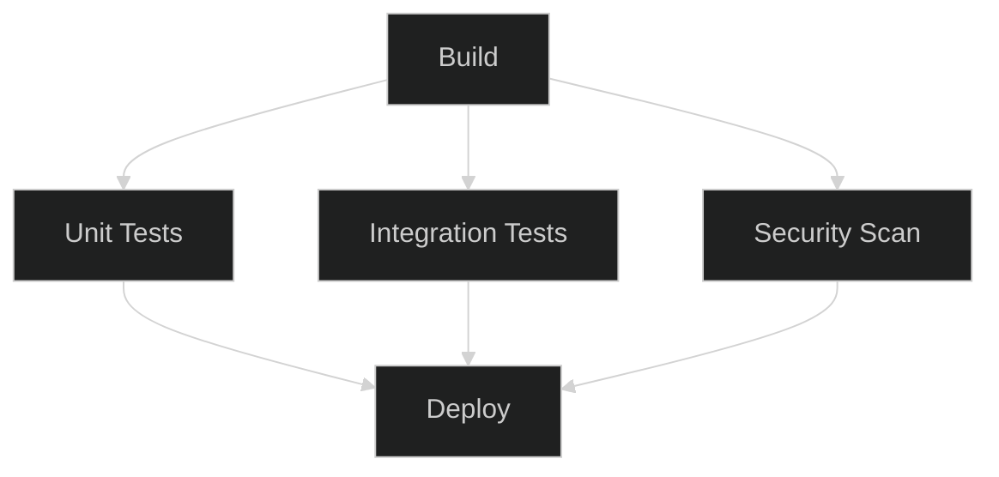
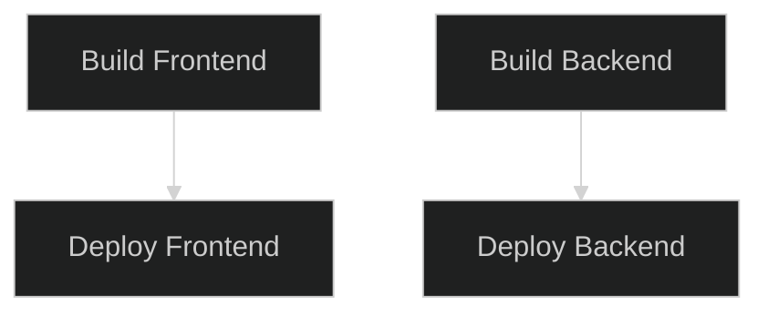

# 03 · Workflow Structure — DAG

> **Jobs run in parallel by default. Use `needs:` to create dependencies — forming a DAG.**

---

## 🔍 What is a DAG?

**DAG = Directed Acyclic Graph** — a flow with a direction and no loops.





---

## 🧬 How `needs` Works



```yaml
jobs:
  lint:                    # ← No 'needs' → runs FIRST
    runs-on: ubuntu-latest
    steps: [...]

  test:
    needs: lint             # ← Waits for lint ✅
    runs-on: ubuntu-latest
    steps: [...]

  security:
    needs: lint             # ← Also waits for lint ✅
    runs-on: ubuntu-latest  #    Runs PARALLEL with test
    steps: [...]

  build:
    needs: [test, security] # ← Waits for BOTH ✅
    runs-on: ubuntu-latest
    steps: [...]

  deploy:
    needs: build            # ← Waits for build ✅
    runs-on: ubuntu-latest
    steps: [...]
```

---

## 📊 Parallel vs Sequential — Visual

```
Timeline →

WITHOUT needs (all parallel):
  ├── Job A ████████
  ├── Job B ████████
  └── Job C ████████
  Total: ~1 unit

WITH needs (sequential chain):
  ├── Job A ████████
  │                 └── Job B ████████
  │                                   └── Job C ████████
  Total: ~3 units

WITH needs (diamond pattern):
  ├── Job A ████████
  │         ├────── Job B ████████
  │         └────── Job C ████████    (B & C run parallel)
  │                          └── Job D ████████
  Total: ~3 units (B and C overlap)
```

---

## 🧩 Common DAG Patterns

### 🔹 Linear Pipeline

```yaml
needs: build    # test waits for build
needs: test     # deploy waits for test
```

### 🔹 Fan-Out / Fan-In (Diamond)

```yaml
needs: build                        # all 3 wait for build
needs: [unit-tests, int-tests, security]  # deploy waits for ALL 3
```

### 🔹 Independent Chains

```yaml
# No needs between chains — fully parallel
```

---

## 🧪 Demo Workflow

📄 **File:** [`.github/workflows/dag-demo.yml`](./.github/workflows/dag-demo.yml)

This demo creates a **diamond DAG** with 4 jobs and prints timing so you can see the parallel execution.

---

## ⚠️ Common Pitfalls

| Mistake | What happens |
|---------|-------------|
| Circular dependency (`A needs B`, `B needs A`) | ❌ GitHub rejects the workflow |
| Typo in `needs` job name | ❌ Workflow fails to parse |
| Forgetting `needs` | Jobs run in parallel (may not be what you want) |

---

[⬅️ Step Types](../02-step-types/) · [Next: Triggering Events ➡️](../04-triggering-events/)
