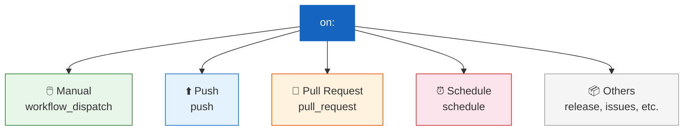
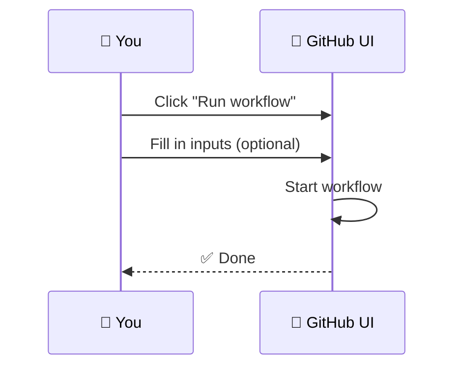
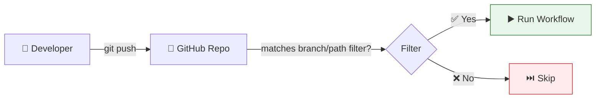
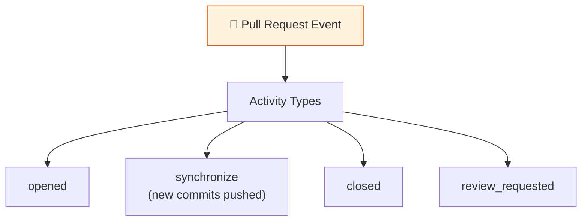
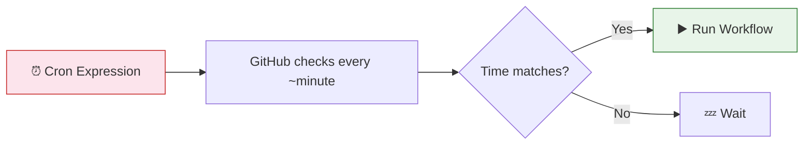
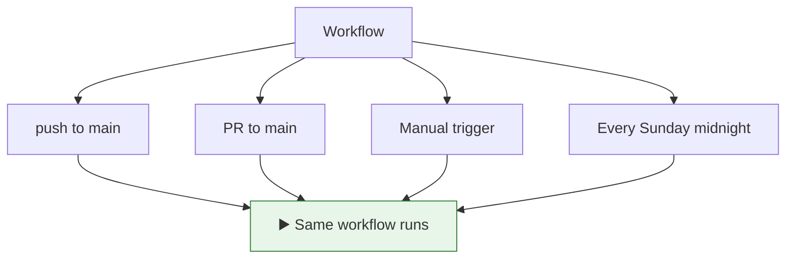

# 04 · Triggering Events

> **The `on:` keyword defines WHEN your workflow runs.**

---

## 🔍 All Trigger Types at a Glance



---

## 📊 Quick Reference

| Trigger | When it fires | Use case |
|---------|--------------|----------|
| `workflow_dispatch` | Manual click in UI | Testing, ad-hoc deploys |
| `push` | Code pushed to branch | CI — lint, test, build |
| `pull_request` | PR opened/updated/merged | Code review checks |
| `schedule` (cron) | On a time schedule | Nightly builds, cleanups |
| `release` | Release published | Publishing packages |
| `workflow_call` | Called by another workflow | Reusable workflows |

---

## 1️⃣ Manual Trigger (`workflow_dispatch`)



```yaml
on:
  workflow_dispatch:
    inputs:                        # 👈 Optional user inputs
      environment:
        description: 'Deploy to which env?'
        required: true
        default: 'staging'
        type: choice
        options:
          - staging
          - production
      debug:
        description: 'Enable debug?'
        type: boolean
        default: false
```

> Access inputs via: `${{ github.event.inputs.environment }}`

---

## 2️⃣ Push Trigger



```yaml
on:
  push:
    branches:
      - main                      # Only on main
      - 'release/**'              # Any release/* branch
    paths:
      - 'src/**'                  # Only if files in src/ changed
      - '!src/**/*.md'            # Ignore markdown changes
    tags:
      - 'v*'                      # On version tags (v1.0, v2.3)
```

### Filter Logic:

```
branches + paths = AND logic
  ├── Branch matches? ──── AND ──── Path matches?
  │        ✅                          ✅          → ▶️ Run
  │        ✅                          ❌          → ⏭️ Skip
  │        ❌                          ✅          → ⏭️ Skip
  └────────❌──────────────────────────❌──────────→ ⏭️ Skip
```

---

## 3️⃣ Pull Request Trigger



```yaml
on:
  pull_request:
    types: [opened, synchronize, reopened]  # 👈 Which PR activities
    branches:
      - main                                 # Only PRs targeting main
    paths:
      - 'src/**'                             # Only if src/ changed
```

> **Default types** (if you don't specify): `opened`, `synchronize`, `reopened`

---

## 4️⃣ Schedule (Cron)



```yaml
on:
  schedule:
    - cron: '30 5 * * 1-5'    # At 5:30 UTC, Monday through Friday
```

### Cron Cheat Sheet:

```
┌───────────── minute (0-59)
│ ┌───────────── hour (0-23)
│ │ ┌───────────── day of month (1-31)
│ │ │ ┌───────────── month (1-12)
│ │ │ │ ┌───────────── day of week (0-6, Sun=0)
│ │ │ │ │
* * * * *
```

| Expression | Meaning |
|------------|---------|
| `0 0 * * *` | Midnight UTC daily |
| `30 5 * * 1-5` | 5:30 AM UTC weekdays |
| `0 */6 * * *` | Every 6 hours |
| `0 9 1 * *` | 9 AM on the 1st of each month |

---

## 🔗 Combining Multiple Triggers

```yaml
on:
  push:
    branches: [main]
  pull_request:
    branches: [main]
  workflow_dispatch:            # Also allow manual trigger
  schedule:
    - cron: '0 0 * * 0'        # Weekly on Sunday midnight
```



---

## 🧪 Demo Workflows

| File | Trigger type |
|------|-------------|
| [`manual-trigger.yml`](./.github/workflows/manual-trigger.yml) | `workflow_dispatch` with inputs |
| [`push-trigger.yml`](./.github/workflows/push-trigger.yml) | `push` with branch/path filters |
| [`pr-trigger.yml`](./.github/workflows/pr-trigger.yml) | `pull_request` events |
| [`cron-trigger.yml`](./.github/workflows/cron-trigger.yml) | `schedule` with cron |

---

## ⚠️ Common Pitfalls

| Mistake | Fix |
|---------|-----|
| Cron runs on wrong timezone | Cron is **always UTC** |
| Cron schedule delays | GitHub doesn't guarantee exact timing (can be up to 15 min late) |
| PR workflows on forks can't access secrets | Use `pull_request_target` (⚠️ carefully) |

---

[⬅️ Workflow Structure (DAG)](../03-workflow-structure-dag/) · [Next: Environment Variables ➡️](../05-environment-variables/)
