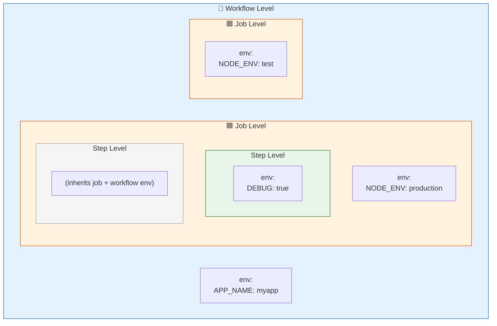

# 05 · Environment Variables

> **Env vars have 3 scopes: workflow, job, and step. Narrower scope wins.**

---

## 🔍 The 3 Scopes — Visual



---

## 🎯 Scope Precedence (Narrower Wins)

```
Priority:   Step env  >  Job env  >  Workflow env

┌─────────────────────────────────────────────────┐
│ Workflow env:  APP_NAME=myapp                   │
│                                                  │
│  ┌────────────────────────────────────────────┐  │
│  │ Job env:  APP_NAME=override-app            │  │
│  │                                             │  │
│  │  ┌──────────────────────────────────────┐   │  │
│  │  │ Step env:  APP_NAME=step-override    │   │  │
│  │  │                                       │   │  │
│  │  │ 👉 $APP_NAME = "step-override"       │   │  │
│  │  └──────────────────────────────────────┘   │  │
│  │                                             │  │
│  │  ┌──────────────────────────────────────┐   │  │
│  │  │ Step env:  (not set)                 │   │  │
│  │  │                                       │   │  │
│  │  │ 👉 $APP_NAME = "override-app"        │   │  │
│  │  └──────────────────────────────────────┘   │  │
│  └────────────────────────────────────────────┘  │
└─────────────────────────────────────────────────┘
```

---

## 📝 Syntax

```yaml
# ──────────────────────────────────────
# 1️⃣ WORKFLOW level env (available everywhere)
# ──────────────────────────────────────
env:
  APP_NAME: my-application
  APP_VERSION: "1.0.0"

jobs:
  build:
    runs-on: ubuntu-latest

    # ──────────────────────────────────
    # 2️⃣ JOB level env (only this job)
    # ──────────────────────────────────
    env:
      NODE_ENV: production
      BUILD_DIR: ./dist

    steps:
      - name: Use workflow + job env
        run: |
          echo "$APP_NAME"     # From workflow
          echo "$NODE_ENV"     # From job

      # ──────────────────────────────
      # 3️⃣ STEP level env (only this step)
      # ──────────────────────────────
      - name: Use step-specific env
        env:
          DEBUG: "true"
          API_URL: "https://api.example.com"
        run: |
          echo "$DEBUG"        # From step
          echo "$APP_NAME"     # Still available from workflow
```

---

## 🔄 Default GitHub Environment Variables

GitHub automatically sets these — you don't need to define them:

| Variable | Value |
|----------|-------|
| `GITHUB_REPOSITORY` | `owner/repo-name` |
| `GITHUB_REF` | `refs/heads/main` |
| `GITHUB_SHA` | Full commit SHA |
| `GITHUB_ACTOR` | Username who triggered |
| `GITHUB_WORKFLOW` | Workflow name |
| `RUNNER_OS` | `Linux`, `Windows`, `macOS` |

---

## 🧪 Demo Workflow

📄 **File:** [`.github/workflows/env-scopes.yml`](./.github/workflows/env-scopes.yml)

---

## ⚠️ Common Pitfalls

| Mistake | Fix |
|---------|-----|
| Using `${{ env.VAR }}` vs `$VAR` | In `run:` use `$VAR`. In `with:` use `${{ env.VAR }}` |
| Expecting job env in a different job | Each job is a separate VM — define env per job |
| Putting secrets in plain `env:` | Use `${{ secrets.NAME }}` instead |

---

[⬅️ Triggering Events](../04-triggering-events/) · [Next: Passing Variables ➡️](../06-passing-variables/)
