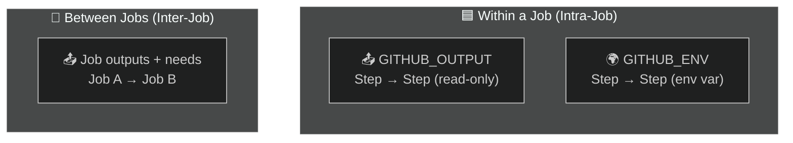
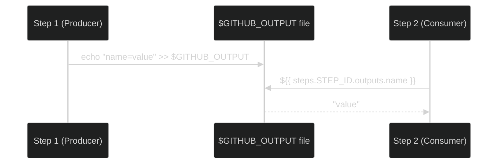
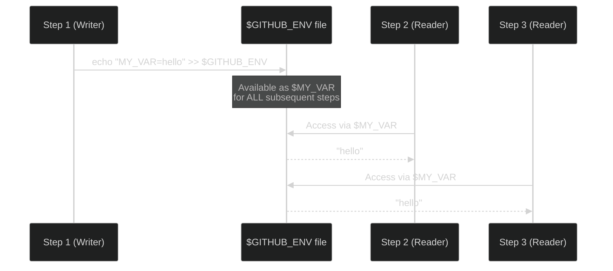
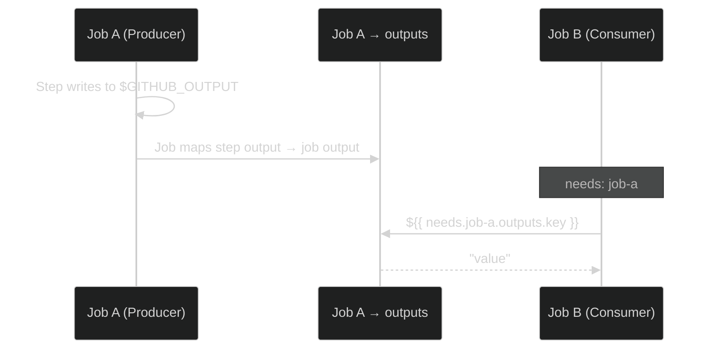

# 06 · Passing Variables

> **3 mechanisms: step→step via `GITHUB_OUTPUT`, step→step via `GITHUB_ENV`, job→job via `outputs`.**

---

## 🔍 The 3 Mechanisms at a Glance



---

## 1️⃣ Step → Step via `GITHUB_OUTPUT`



```yaml
steps:
  # Step 1: WRITE an output
  - name: Set version
    id: version_step            # 👈 MUST have an id
    run: echo "version=2.1.0" >> $GITHUB_OUTPUT

  # Step 2: READ the output
  - name: Use version
    run: echo "Version is ${{ steps.version_step.outputs.version }}"
```

### Key Rules:
```
✅ Producer step MUST have an `id:`
✅ Format: echo "key=value" >> $GITHUB_OUTPUT
✅ Consumer uses: ${{ steps.<id>.outputs.<key> }}
```

---

## 2️⃣ Step → Step via `GITHUB_ENV`



```yaml
steps:
  # Step 1: Set env var for subsequent steps
  - name: Set dynamic env var
    run: echo "DEPLOY_TAG=release-$(date +%Y%m%d)" >> $GITHUB_ENV

  # Step 2: Use it (no id needed, just $VAR)
  - name: Use the env var
    run: echo "Deploying tag: $DEPLOY_TAG"
```

---

## 📊 GITHUB_OUTPUT vs GITHUB_ENV

| | `GITHUB_OUTPUT` | `GITHUB_ENV` |
|---|---|---|
| **How to write** | `echo "key=val" >> $GITHUB_OUTPUT` | `echo "KEY=val" >> $GITHUB_ENV` |
| **How to read** | `${{ steps.id.outputs.key }}` | `$VAR` or `${{ env.KEY }}` |
| **Needs step `id`?** | ✅ Yes | ❌ No |
| **Available in `with:`?** | ✅ `${{ steps.id.outputs.key }}` | ✅ `${{ env.KEY }}` |
| **Available in `run:`?** | Only via expression | Directly as `$VAR` |
| **Best for** | Passing specific values | Setting env for many steps |

---

## 3️⃣ Job → Job via `outputs` + `needs`



```yaml
jobs:
  # ──── Job A: Produce outputs ────
  job-a:
    runs-on: ubuntu-latest
    outputs:                              # 👈 Job-level output mapping
      build_version: ${{ steps.build.outputs.version }}
    steps:
      - name: Build
        id: build
        run: echo "version=3.5.1" >> $GITHUB_OUTPUT

  # ──── Job B: Consume outputs ────
  job-b:
    needs: job-a                           # 👈 MUST declare dependency
    runs-on: ubuntu-latest
    steps:
      - name: Deploy
        run: |
          echo "Deploying version ${{ needs.job-a.outputs.build_version }}"
```

### The Chain Visualized:

```
Job A                                    Job B
┌─────────────────────────┐             ┌─────────────────────────┐
│ Step (id: build)        │             │ needs: job-a            │
│   ↓                     │             │                         │
│ $GITHUB_OUTPUT          │ ─────────→  │ ${{ needs.job-a.       │
│   ↓                     │  (via job   │    outputs.version }}   │
│ outputs:                │  outputs)   │                         │
│   version: ${{ steps.   │             │ = "3.5.1"              │
│     build.outputs.ver}} │             │                         │
└─────────────────────────┘             └─────────────────────────┘
```

---

## 🧪 Demo Workflows

| File | What it demonstrates |
|------|---------------------|
| [`intra-job-output.yml`](./.github/workflows/intra-job-output.yml) | Step→Step via `$GITHUB_OUTPUT` |
| [`intra-job-env.yml`](./.github/workflows/intra-job-env.yml) | Step→Step via `$GITHUB_ENV` |
| [`inter-job-output.yml`](./.github/workflows/inter-job-output.yml) | Job→Job via `outputs` + `needs` |

---

## ⚠️ Common Pitfalls

| Mistake | Fix |
|---------|-----|
| Forgetting `id:` on producer step | Outputs are accessed via step id — always add one |
| Using `set-output` (deprecated) | Use `>> $GITHUB_OUTPUT` (new syntax since Oct 2022) |
| Missing `outputs:` mapping at job level | Inter-job requires explicit mapping |
| Forgetting `needs:` on consumer job | Without `needs`, the consumer can't access outputs |

---

[⬅️ Environment Variables](../05-environment-variables/) · [Next: Secrets & Variables ➡️](../07-secrets-and-variables/)
