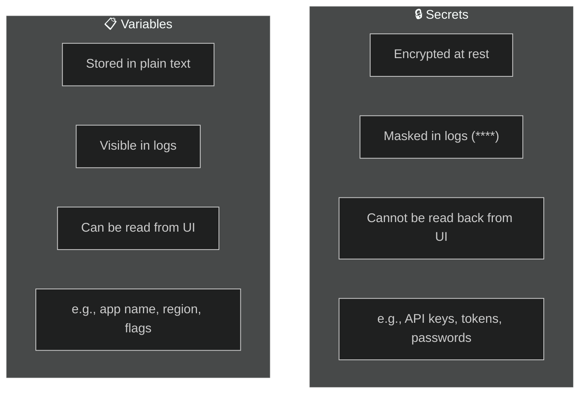
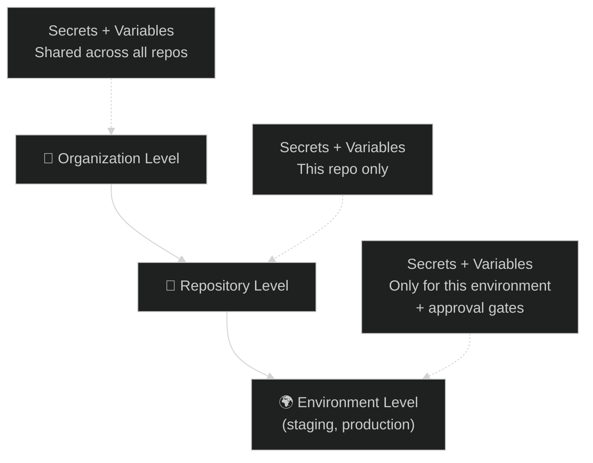
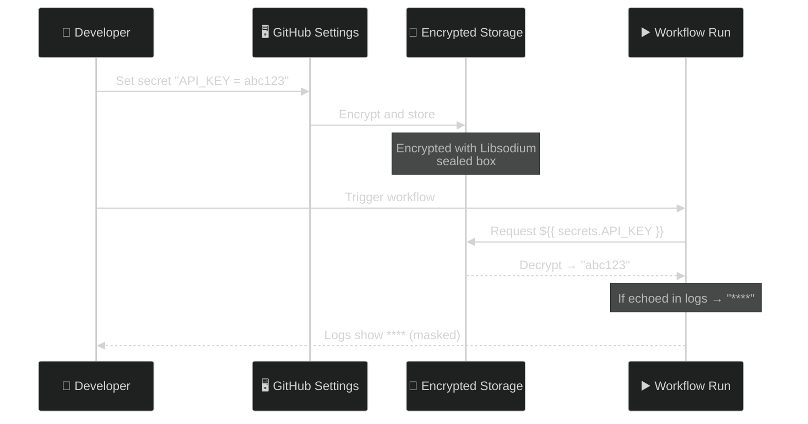

# 07 · Secrets and Variables

> **Secrets = encrypted, masked in logs. Variables = plain config values.**

---

## 🔍 Secrets vs Variables



---

## 🏗️ Where They Live — 3 Levels



### Precedence (narrower wins):

```
Environment secret  >  Repository secret  >  Organization secret

┌─────────────────────────────────────────────┐
│ Org:  API_KEY = "org-default-key"           │
│  ┌───────────────────────────────────────┐  │
│  │ Repo: API_KEY = "repo-specific-key"  │  │
│  │  ┌────────────────────────────────┐   │  │
│  │  │ Env (prod): API_KEY = "prod-x" │  │  │
│  │  │ 👉 This one wins in prod env   │  │  │
│  │  └────────────────────────────────┘   │  │
│  └───────────────────────────────────────┘  │
└─────────────────────────────────────────────┘
```

---

## 📝 How to Set Them

### Via GitHub UI:

```
Repository → Settings → Secrets and variables → Actions
  ├── Secrets tab → "New repository secret"
  └── Variables tab → "New repository variable"
```

### Via CLI:

```bash
# Set a secret
gh secret set API_KEY --body "my-secret-value"

# Set a variable
gh variable set APP_REGION --body "us-east-1"

# Set environment-specific secret
gh secret set DB_PASSWORD --env production --body "p@ssw0rd"
```

---

## 📝 How to Use Them

```yaml
jobs:
  deploy:
    runs-on: ubuntu-latest
    environment: production              # 👈 Activates env-level secrets
    steps:
      - name: Use a secret
        env:
          API_KEY: ${{ secrets.API_KEY }}  # 👈 secrets context
        run: |
          echo "Key length: ${#API_KEY}"
          # echo "$API_KEY"   ← This would show **** in logs

      - name: Use a variable
        run: |
          echo "Region: ${{ vars.APP_REGION }}"   # 👈 vars context
          echo "App: ${{ vars.APP_NAME }}"
```

---

## 🔒 Security Flow



---

## 🧪 Demo Workflow

📄 **File:** [`.github/workflows/secrets-demo.yml`](./.github/workflows/secrets-demo.yml)

> ⚠️ **Before running:** Create these in your repo settings:
> - Secret: `DEMO_SECRET` = any value
> - Variable: `DEMO_VAR` = any value

---

## ⚠️ Common Pitfalls

| Mistake | Fix |
|---------|-----|
| Echoing secrets in logs | GitHub masks them, but avoid `echo $SECRET` anyway |
| Concatenating secrets to bypass masking | `echo "${SECRET}x"` can leak — be careful |
| Using secrets in `if:` conditions | Secrets can't be directly used in `if:` — set as env first |
| PRs from forks can't access secrets | By design — use `pull_request_target` carefully |

---

[⬅️ Passing Variables](../06-passing-variables/) · [Next: GitHub Contexts ➡️](../08-github-contexts/)
