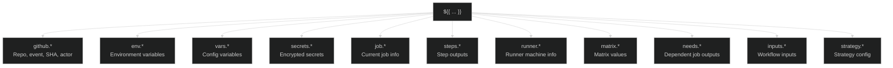
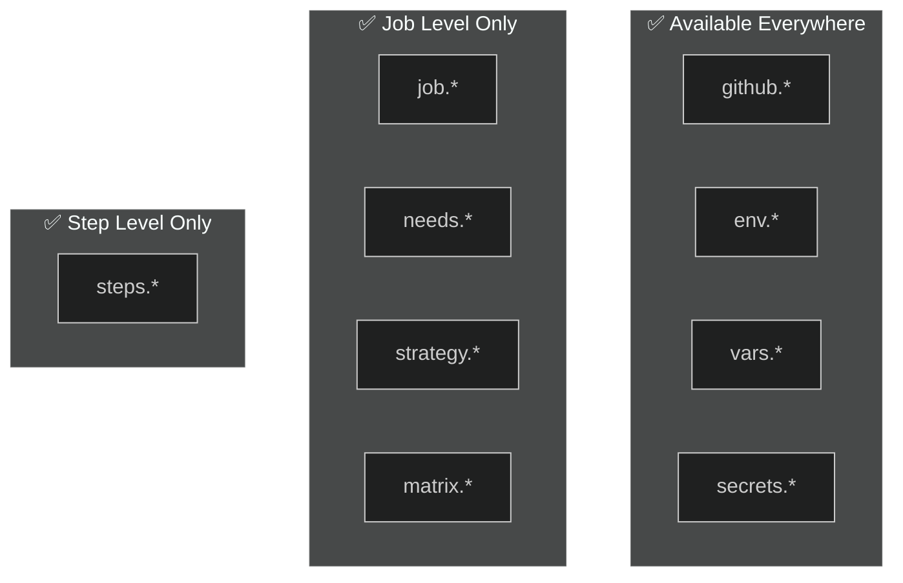

# 08 · GitHub Contexts

> **Contexts are objects that provide metadata about the workflow run, repo, runner, and more.**

---

## 🔍 All Contexts at a Glance



---

## 📊 Most Used Contexts

### `github.*` — Repository & Event Metadata

| Property | Example Value | Use Case |
|----------|---------------|----------|
| `github.repository` | `octocat/hello-world` | Tagging images |
| `github.ref` | `refs/heads/main` | Branch detection |
| `github.ref_name` | `main` | Clean branch name |
| `github.sha` | `abc123def456...` | Version tagging |
| `github.actor` | `octocat` | Audit logs |
| `github.event_name` | `push` | Conditional logic |
| `github.run_id` | `1234567890` | Unique run identifier |
| `github.run_number` | `42` | Sequential build number |
| `github.workspace` | `/home/runner/work/...` | File paths |

### `runner.*` — Machine Information

| Property | Example Value |
|----------|---------------|
| `runner.os` | `Linux`, `Windows`, `macOS` |
| `runner.arch` | `X64`, `ARM64` |
| `runner.name` | `GitHub Actions 2` |
| `runner.temp` | `/home/runner/work/_temp` |

### `matrix.*` — Current Matrix Combination

```yaml
strategy:
  matrix:
    os: [ubuntu-latest, windows-latest]
    node: [18, 20]

# In steps:
# ${{ matrix.os }}   → "ubuntu-latest"
# ${{ matrix.node }} → 18
```

---

## 🔄 Context Availability by Scope



---

## 📝 Usage Patterns

```yaml
steps:
  - name: Using contexts
    run: |
      # github context
      echo "Repo: ${{ github.repository }}"
      echo "Branch: ${{ github.ref_name }}"
      echo "SHA: ${{ github.sha }}"

      # runner context
      echo "OS: ${{ runner.os }}"

      # env context (in 'with:' blocks)
      # echo "${{ env.MY_VAR }}"

  - name: Conditional with context
    if: github.ref_name == 'main'
    run: echo "Running on main branch!"

  - name: Dynamic values
    run: |
      IMAGE="ghcr.io/${{ github.repository }}:${{ github.sha }}"
      echo "Docker image: $IMAGE"
```

---

## 🧪 Demo Workflow

📄 **File:** [`.github/workflows/contexts-explorer.yml`](./.github/workflows/contexts-explorer.yml)

Prints every major context so you can see all available metadata.

---

## ⚠️ Common Pitfalls

| Mistake | Fix |
|---------|-----|
| `${{ github.branch }}` | ❌ Doesn't exist — use `github.ref_name` |
| Using context in wrong scope | `steps.*` only works in steps, not in job-level `if:` |
| `${{ secrets.* }}` in `if:` | Wrap: `if: env.MY_SEC != ''` after setting `env:` |

---

[⬅️ Secrets & Variables](../07-secrets-and-variables/) · [Next: Runners ➡️](../09-runners/)
