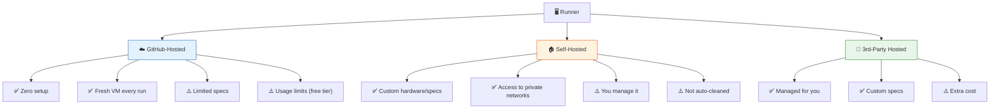
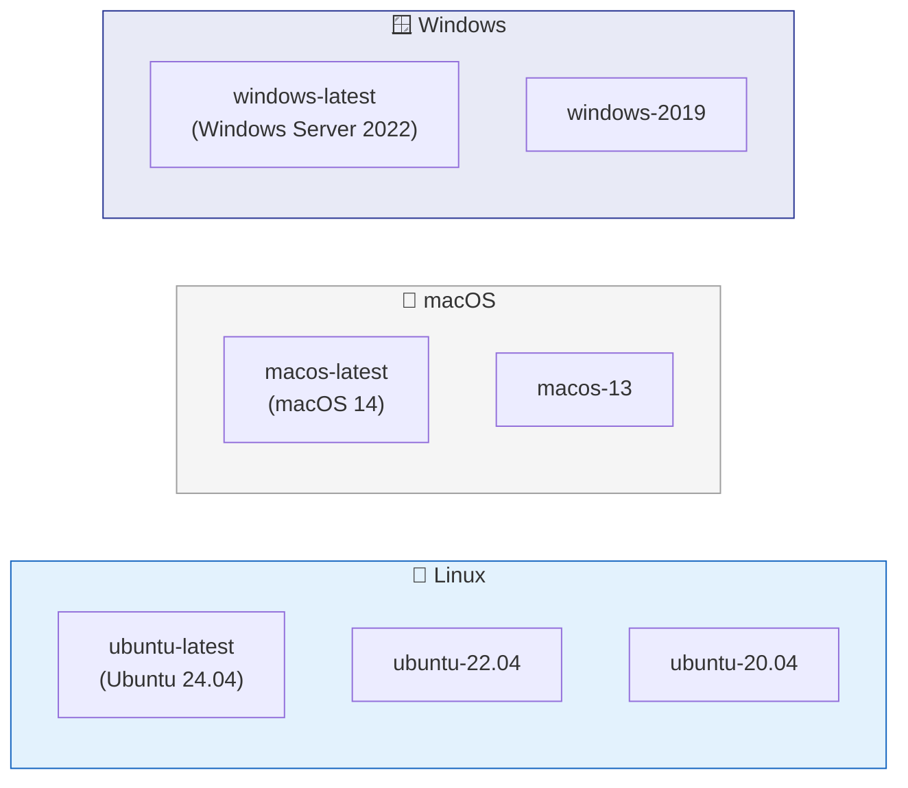
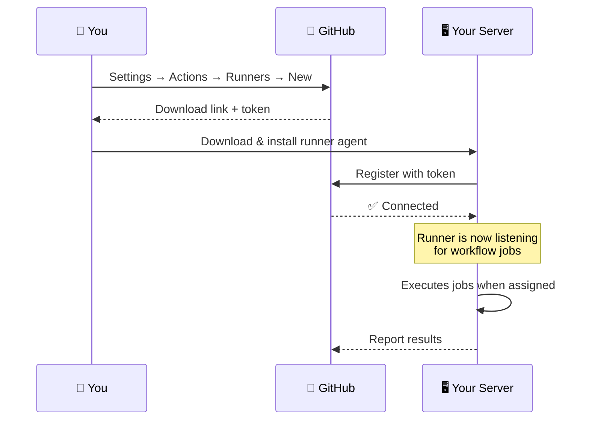

# 09 · Runners

> **Runners are the machines that execute your jobs. 3 types: GitHub-hosted, self-hosted, 3rd-party.**

---

## 🔍 The 3 Types



---

## 📊 Comparison

| | GitHub-Hosted | Self-Hosted | 3rd-Party |
|---|---|---|---|
| **Setup** | None | Install agent on your server | Sign up + configure |
| **Cost** | Free tier + paid | Your infra cost | Vendor pricing |
| **Specs** | 2 vCPU, 7GB RAM | Whatever you have | Configurable |
| **Clean slate** | ✅ Fresh VM each time | ❌ Persistent (you clean) | Varies |
| **Private network** | ❌ Public internet only | ✅ Your network | Varies |
| **`runs-on`** | `ubuntu-latest` | `self-hosted` | Vendor-specific |
| **Examples** | — | Your own server | BuildJet, Namespace, Actuated |

---

## ☁️ GitHub-Hosted Runners

### Available Machines:



```yaml
jobs:
  linux-job:
    runs-on: ubuntu-latest      # Most common

  mac-job:
    runs-on: macos-latest       # For iOS/macOS builds

  windows-job:
    runs-on: windows-latest     # For .NET/Windows builds
```

---

## 🏠 Self-Hosted Runners

### Setup Flow:



```yaml
jobs:
  on_premises:
    runs-on: self-hosted        # 👈 Basic self-hosted

  with_labels:
    runs-on: [self-hosted, linux, gpu]   # 👈 With labels
```

---

## 🧪 Demo Workflow

📄 **File:** [`.github/workflows/multi-runner.yml`](./.github/workflows/multi-runner.yml)

Runs the **same job** on all 3 OS runners so you can compare their output.

---

## ⚠️ Common Pitfalls

| Mistake | Fix |
|---------|-----|
| Using `macos` for simple tasks | macOS runners cost **10x** more minutes — use Linux |
| Self-hosted runner not secured | Add labels, restrict to private repos, use ephemeral runners |
| Hardcoding Linux paths on multi-OS | Use `${{ runner.temp }}` instead of `/tmp` |

---

[⬅️ GitHub Contexts](../08-github-contexts/) · [Next: Artifacts & Cache ➡️](../10-artifacts-and-cache/)
