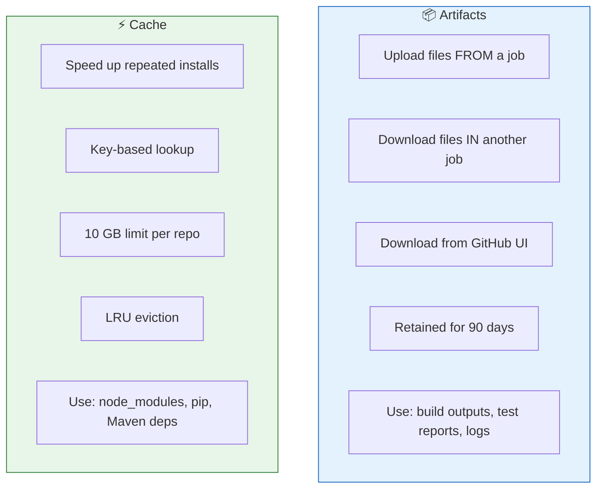
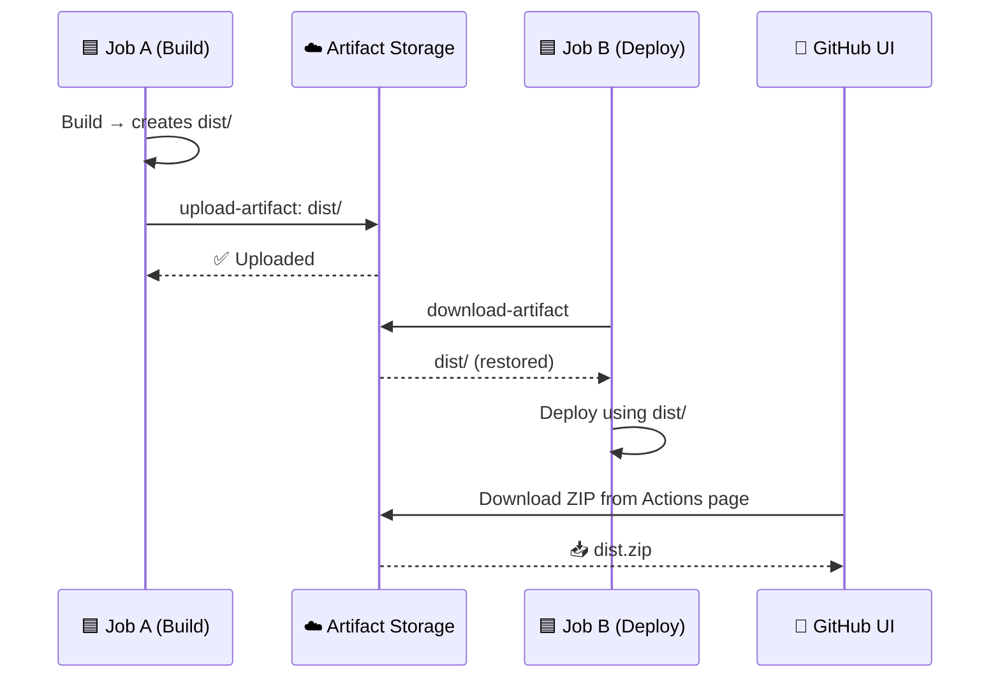
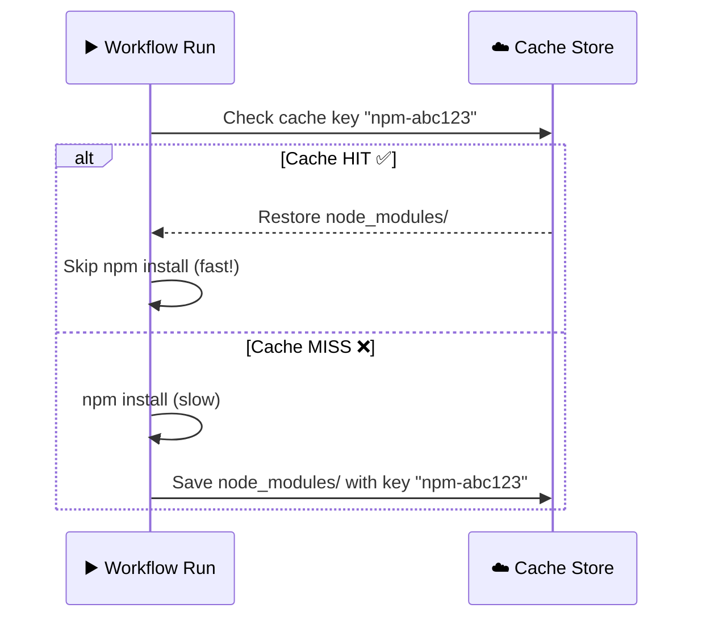

# 10 · Artifacts and Cache

> **Jobs run on ephemeral VMs — when the job ends, everything is gone. Artifacts and cache persist data.**

---

## 🔍 Artifacts vs Cache



---

## 📊 Quick Comparison

| | Artifacts | Cache |
|---|---|---|
| **Purpose** | Share files between jobs / download later | Speed up dependency installs |
| **Lifetime** | 90 days (configurable) | LRU evicted, 10 GB limit |
| **Scope** | Workflow run (cross-job) | Repository (cross-run) |
| **Action** | `upload-artifact` / `download-artifact` | `actions/cache` |
| **Accessible from UI?** | ✅ Yes (download ZIP) | ❌ No |

---

## 📦 Artifacts Flow



### Upload:

```yaml
- uses: actions/upload-artifact@v4
  with:
    name: build-output          # Artifact name
    path: dist/                 # What to upload
    retention-days: 30          # How long to keep (default: 90)
```

### Download:

```yaml
- uses: actions/download-artifact@v4
  with:
    name: build-output          # Must match upload name
    path: ./downloaded/         # Where to put it
```

---

## ⚡ Cache Flow



### Usage:

```yaml
- uses: actions/cache@v4
  with:
    path: ~/.npm                                    # What to cache
    key: npm-${{ runner.os }}-${{ hashFiles('**/package-lock.json') }}
    restore-keys: |                                 # Fallback keys
      npm-${{ runner.os }}-
```

### Cache Key Strategy:

```
key: npm-Linux-abc123def   ← Exact match (ideal)
                ↓ miss
restore-keys:
  npm-Linux-              ← Prefix match (close enough)
                ↓ miss
  npm-                    ← Broader prefix
                ↓ miss
  (cache miss — full install)
```

---

## 🧪 Demo Workflows

| File | What it demonstrates |
|------|---------------------|
| [`upload-download.yml`](./.github/workflows/upload-download.yml) | Artifact upload in Job A → download in Job B |
| [`cache-demo.yml`](./.github/workflows/cache-demo.yml) | Dependency caching with `actions/cache` |

---

## ⚠️ Common Pitfalls

| Mistake | Fix |
|---------|-----|
| Artifact name collision across matrix jobs | Include `${{ matrix.os }}` in artifact name |
| Cache key too generic | Use `hashFiles()` to include lock file hash |
| Caching `node_modules/` directly | Cache `~/.npm` instead — more reliable |
| Cache > 10 GB | Least recently used caches get evicted |

---

[⬅️ Runners](../09-runners/) · [Next: Matrix & Conditionals ➡️](../11-matrix-and-conditionals/)
