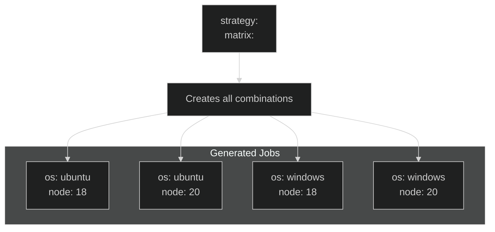
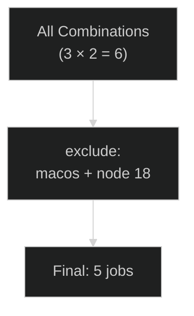
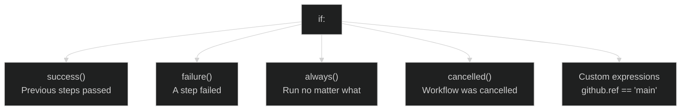
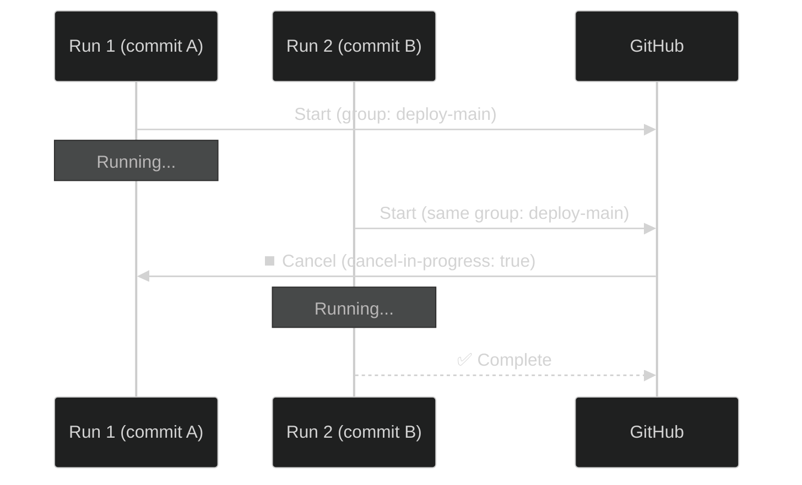

# 11 · Matrix and Conditionals

> **Matrix = run the same job with multiple configurations. Conditionals = skip/run steps/jobs based on conditions.**

---

## 🔍 Matrix — The Big Picture



```yaml
strategy:
  matrix:
    os: [ubuntu-latest, windows-latest]    # 2 values
    node: [18, 20]                          # 2 values
                                            # = 2 × 2 = 4 jobs!
runs-on: ${{ matrix.os }}
steps:
  - uses: actions/setup-node@v4
    with:
      node-version: ${{ matrix.node }}
```

---

## 📊 Matrix Math

```
matrix:
  os: [ubuntu, windows, macos]     → 3
  node: [16, 18, 20]               → 3
  database: [postgres, mysql]       → 2
                                    ────
                                    3 × 3 × 2 = 18 jobs!
```

> ⚠️ Max 256 jobs per matrix. Be mindful of combinations.

---

## 🔧 Matrix Modifiers

### Include (add specific combos):

```yaml
strategy:
  matrix:
    os: [ubuntu-latest, windows-latest]
    node: [18, 20]
    include:
      - os: ubuntu-latest
        node: 22                    # 👈 Extra combo added
        experimental: true
```

### Exclude (remove specific combos):

```yaml
strategy:
  matrix:
    os: [ubuntu-latest, windows-latest, macos-latest]
    node: [18, 20]
    exclude:
      - os: macos-latest
        node: 18                    # 👈 This combo removed
```



---

## 🛑 Fail-Fast & Max Parallel

```yaml
strategy:
  fail-fast: false          # Don't cancel other jobs if one fails
  max-parallel: 3           # Run at most 3 jobs at a time
  matrix:
    os: [ubuntu-latest, windows-latest, macos-latest]
    node: [18, 20, 22]
```

```
fail-fast: true (default)         fail-fast: false
┌──────────────────────┐         ┌──────────────────────┐
│ Job 1: ✅             │         │ Job 1: ✅             │
│ Job 2: ❌ FAILED      │         │ Job 2: ❌ FAILED      │
│ Job 3: ⏹️ CANCELLED   │         │ Job 3: ✅ (continues) │
│ Job 4: ⏹️ CANCELLED   │         │ Job 4: ✅ (continues) │
└──────────────────────┘         └──────────────────────┘
```

---

## 🔀 Conditionals (`if:`)

### Job-level:

```yaml
jobs:
  deploy:
    if: github.ref_name == 'main'     # Only deploy from main
    runs-on: ubuntu-latest
```

### Step-level:

```yaml
steps:
  - name: Only on success
    if: success()                     # Default (can omit)

  - name: Only on failure
    if: failure()                     # Run when previous step failed

  - name: Always run (cleanup)
    if: always()                      # Run no matter what

  - name: Only on main branch
    if: github.ref_name == 'main'

  - name: Only on PR
    if: github.event_name == 'pull_request'

  - name: Skip if label present
    if: "!contains(github.event.pull_request.labels.*.name, 'skip-ci')"
```

### Common `if:` Patterns:



---

## 🔒 Concurrency

```yaml
# Prevent duplicate runs on the same branch
concurrency:
  group: deploy-${{ github.ref }}
  cancel-in-progress: true       # Cancel older runs
```



---

## 🧪 Demo Workflow

📄 **File:** [`.github/workflows/matrix-demo.yml`](./.github/workflows/matrix-demo.yml)

---

## ⚠️ Common Pitfalls

| Mistake | Fix |
|---------|-----|
| Matrix explosion (too many combos) | Use `max-parallel` and `exclude` |
| `fail-fast: true` hides failures | Set `false` for CI to see all failures |
| String comparison in `if:` | Use `==` not `=`. Wrap in quotes if needed |

---

[⬅️ Artifacts & Cache](../10-artifacts-and-cache/) · [Next: Permissions & Auth ➡️](../12-permissions-and-auth/)
