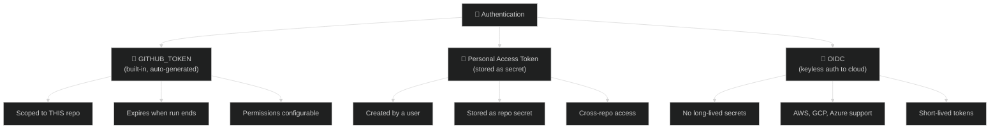
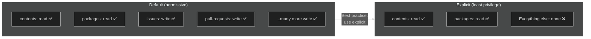
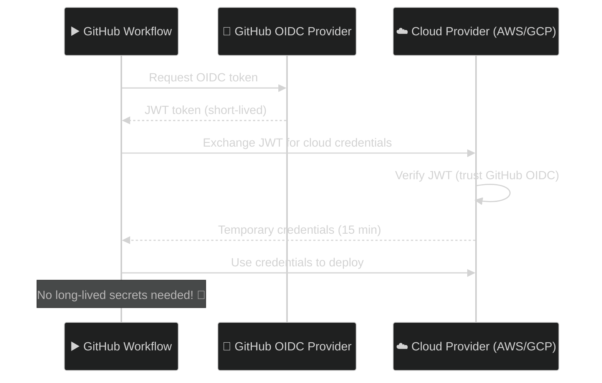

# 12 · Permissions and Auth

> **`GITHUB_TOKEN` is auto-generated per run. You can scope its permissions and use OIDC for external services.**

---

## 🔍 Authentication Layers



---

## 🔑 GITHUB_TOKEN Permissions

### Default vs Explicit:



### Setting Permissions:

```yaml
# ── Workflow-level (applies to all jobs) ──
permissions:
  contents: read
  packages: write

jobs:
  build:
    runs-on: ubuntu-latest

    # ── Job-level (overrides workflow-level) ──
    permissions:
      contents: read
      pull-requests: write

    steps:
      - uses: actions/checkout@v4        # Needs contents: read
```

### Permission Reference:

| Scope | `read` | `write` | Common Use |
|-------|--------|---------|------------|
| `contents` | Checkout code | Push commits, create releases |
| `packages` | Pull images | Push images to GHCR |
| `pull-requests` | Read PR info | Comment on PRs |
| `issues` | Read issues | Create/update issues |
| `id-token` | — | OIDC authentication |
| `actions` | Read workflow | Cancel/rerun workflows |

---

## 🪪 OIDC — Keyless Cloud Auth



### Example — AWS OIDC:

```yaml
permissions:
  id-token: write              # 👈 Required for OIDC
  contents: read

steps:
  - uses: aws-actions/configure-aws-credentials@v4
    with:
      role-to-assume: arn:aws:iam::123456789:role/github-actions
      aws-region: us-east-1
      # No AWS_ACCESS_KEY needed! 🎉

  - run: aws s3 ls               # Now authenticated via OIDC
```

---

## 🧪 Demo Workflow

📄 **File:** [`.github/workflows/permissions-demo.yml`](./.github/workflows/permissions-demo.yml)

---

## ⚠️ Common Pitfalls

| Mistake | Fix |
|---------|-----|
| Using default (permissive) permissions | Always set explicit `permissions:` |
| Storing cloud keys as secrets | Use OIDC instead (no long-lived secrets) |
| `GITHUB_TOKEN` can't access other repos | Use a PAT secret or GitHub App token |
| Fork PRs have read-only token | By design — prevents secret exfiltration |

---

[⬅️ Matrix & Conditionals](../11-matrix-and-conditionals/) · [Next: Real-World CI/CD ➡️](../13-real-world-ci-cd/)
