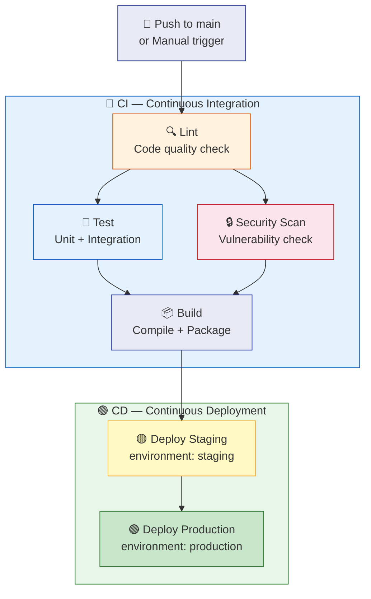
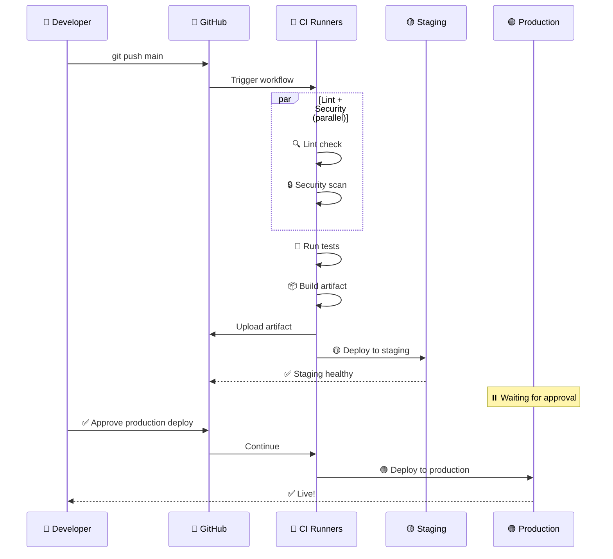
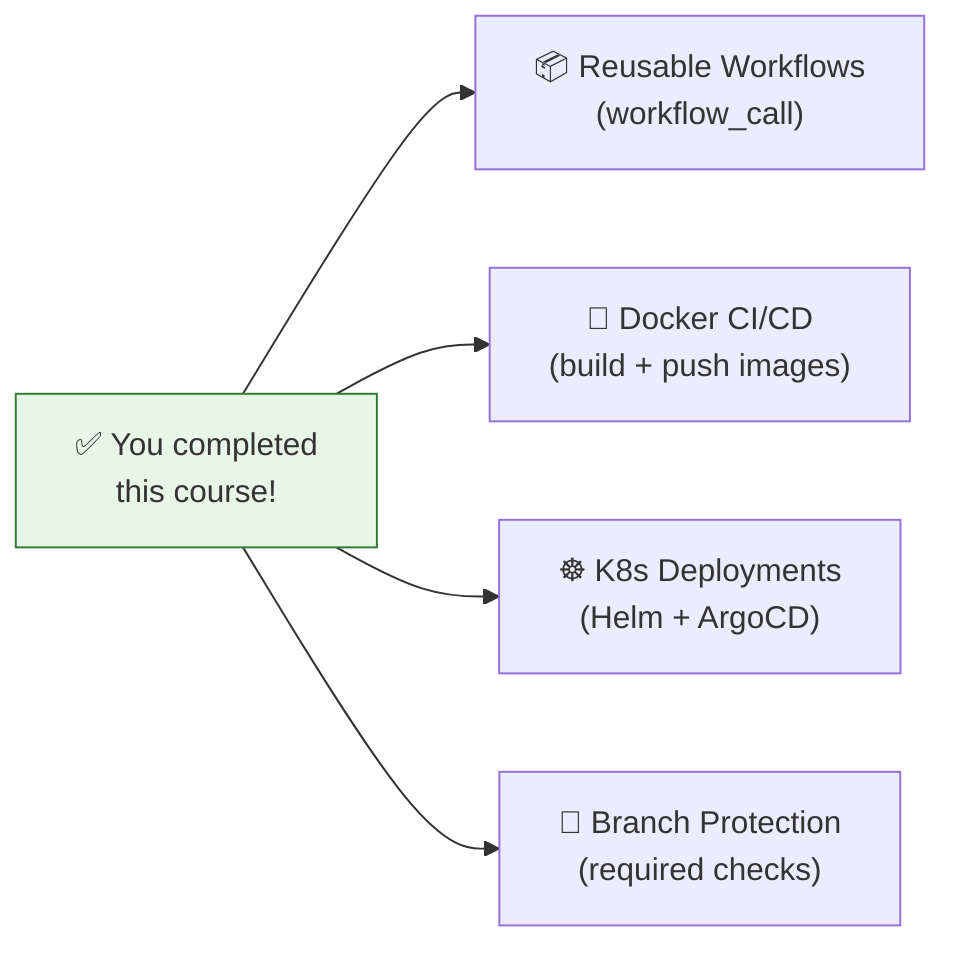

# 13 · Real-World CI/CD Pipeline (Capstone)

> **Everything combined: a production-grade pipeline with lint → test → build → deploy.**

---

## 🔍 The Complete Pipeline



---

## 📊 CI vs CD — What's the Difference?

```
┌─────────────────────────────────────────────────────────────┐
│                                                              │
│  CI (Continuous Integration)                                 │
│  ─────────────────────────                                   │
│  "Does the code work?"                                       │
│                                                              │
│  ┌──────┐  ┌──────┐  ┌──────────┐  ┌───────┐               │
│  │ Lint │→ │ Test │→ │ Security │→ │ Build │               │
│  └──────┘  └──────┘  └──────────┘  └───────┘               │
│                                                              │
│  • Runs on EVERY push / PR                                   │
│  • Fast feedback (< 10 min)                                  │
│  • Catches bugs before merge                                 │
│                                                              │
├──────────────────────────────────────────────────────────────┤
│                                                              │
│  CD (Continuous Deployment)                                  │
│  ──────────────────────────                                  │
│  "Ship it!"                                                  │
│                                                              │
│  ┌─────────────┐  ┌──────────────────┐                      │
│  │ Deploy      │→ │ Deploy           │                      │
│  │ Staging     │  │ Production       │                      │
│  │ (auto)      │  │ (manual approve) │                      │
│  └─────────────┘  └──────────────────┘                      │
│                                                              │
│  • Runs only on main branch (after CI passes)                │
│  • Staging = automatic                                       │
│  • Production = requires approval                            │
│                                                              │
└──────────────────────────────────────────────────────────────┘
```

---

## 🔄 Execution Timeline



---

## 📝 Pipeline Anatomy — Concept Mapping

Every concept you learned maps to a part of this pipeline:

| Module | Where it appears |
|--------|-----------------|
| 01 - Workflow/Job/Step | The entire YAML structure |
| 02 - Step Types | `run:` commands + `uses:` actions |
| 03 - DAG | `needs:` between lint → test → build → deploy |
| 04 - Triggers | `push` to main + `workflow_dispatch` |
| 05 - Env Variables | `env:` at workflow and job levels |
| 06 - Passing Variables | `outputs` from build → deploy |
| 07 - Secrets | `${{ secrets.DEPLOY_TOKEN }}` |
| 08 - Contexts | `${{ github.sha }}` for versioning |
| 09 - Runners | `runs-on: ubuntu-latest` |
| 10 - Artifacts | Build artifact uploaded → downloaded for deploy |
| 11 - Matrix | Test across multiple Node versions |
| 12 - Permissions | `contents: read`, `packages: write` |

---

## 🧪 Demo Workflow

📄 **File:** [`.github/workflows/full-pipeline.yml`](./.github/workflows/full-pipeline.yml)

### How to test:
1. Copy to your repo's `.github/workflows/`
2. Go to **Actions tab** → **"13 - Full CI/CD Pipeline"** → **"Run workflow"**
3. Watch the DAG execute: lint → test → build → staging → production
4. Every stage prints detailed output

---

## 🏗️ Extending This Pipeline

### Add Docker build:
```yaml
- name: Build Docker image
  run: docker build -t ghcr.io/${{ github.repository }}:${{ github.sha }} .

- name: Push to registry
  run: docker push ghcr.io/${{ github.repository }}:${{ github.sha }}
```

### Add Kubernetes deploy:
```yaml
- name: Deploy to K8s
  run: |
    kubectl set image deployment/app \
      app=ghcr.io/${{ github.repository }}:${{ github.sha }}
```

### Add Slack notification:
```yaml
- name: Notify Slack
  if: always()
  uses: slackapi/slack-github-action@v1
  with:
    channel-id: 'deployments'
    slack-message: "Deploy ${{ job.status }}: ${{ github.repository }}@${{ github.sha }}"
```

---

## 🎓 What's Next?



---

[⬅️ Permissions & Auth](../12-permissions-and-auth/) · [🏠 Back to Roadmap](../README.md)
