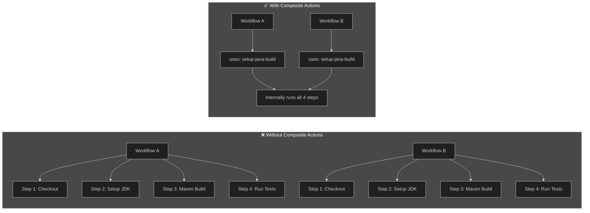
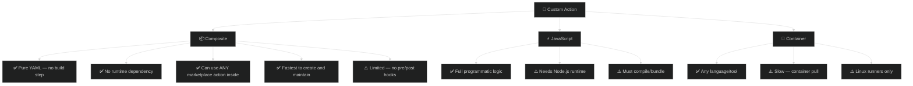
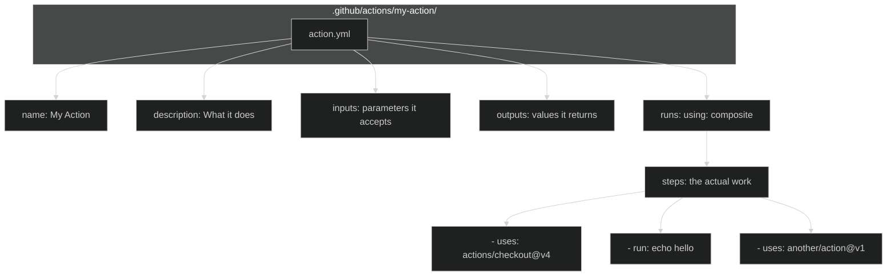
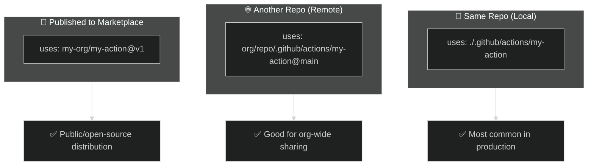
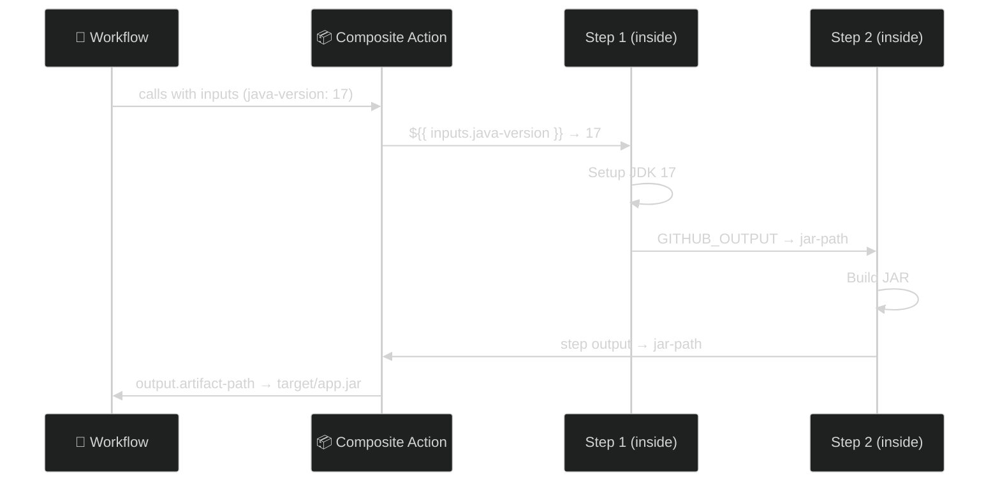
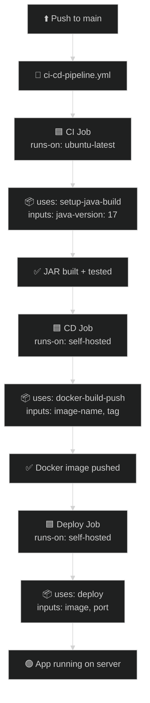
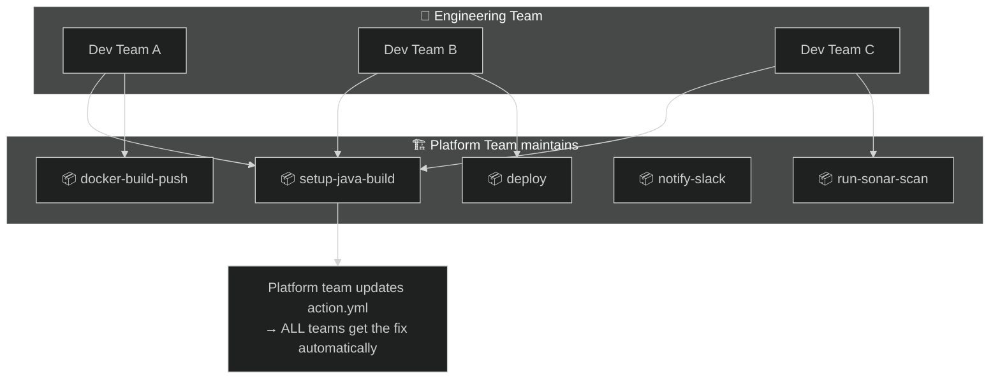

# 14 · Composite Actions — The Industry Standard

> **A composite action bundles multiple steps into one reusable `uses:` block. No Node.js, no Docker — just YAML.**

---

## 🔍 What is a Composite Action?



> **One action.yml → multiple workflows reuse it → DRY pipelines**

---

## 🔍 Composite vs Other Action Types



---

## 🔍 The action.yml Anatomy

Every composite action lives in its own folder and has **one required file: `action.yml`**



### Syntax Breakdown

```yaml
# .github/actions/my-action/action.yml

name: "My Custom Action"              # 👈 Display name
description: "Does X, Y, Z"           # 👈 What it does

# ─── INPUTS (parameters the caller passes in) ───
inputs:
  java-version:
    description: "JDK version"
    required: true                     # 👈 Caller MUST provide
    default: "17"                      # 👈 Optional default
  build-args:
    description: "Extra Maven args"
    required: false

# ─── OUTPUTS (values returned to the caller) ───
outputs:
  artifact-path:
    description: "Path to built JAR"
    value: ${{ steps.build.outputs.jar-path }}  # 👈 From a step

# ─── THE COMPOSITE RUNTIME ───
runs:
  using: "composite"                   # 👈 THIS makes it composite
  steps:
    - name: Checkout
      uses: actions/checkout@v4        # 👈 Can use marketplace actions

    - name: Setup JDK
      uses: actions/setup-java@v4
      with:
        java-version: ${{ inputs.java-version }}  # 👈 Access inputs

    - name: Build
      id: build
      shell: bash                      # 👈 MUST specify shell in composite
      run: |
        mvn clean package ${{ inputs.build-args }}
        echo "jar-path=target/*.jar" >> $GITHUB_OUTPUT
```

> **🔑 Key Rules:**
> - `runs.using` MUST be `"composite"`
> - Every `run:` step MUST have `shell:` specified (bash, pwsh, etc.)
> - Access inputs with `${{ inputs.xxx }}` (not `env`)
> - Can mix `run:` and `uses:` steps freely

---

## 🔍 How to Reference Composite Actions



---

## 🔍 Input/Output Data Flow



---

## 🏗️ Real Project Structure — Java CI/CD with Composites

This module includes a **complete working example**:

```
14-composite-actions/
├── README.md                              ← You are here
├── app/                                   ← Sample Java app
│   ├── src/main/java/com/demo/App.java
│   ├── src/main/resources/application.properties
│   ├── pom.xml
│   └── Dockerfile
├── .github/
│   ├── actions/                           ← 🔑 Composite actions live here
│   │   ├── setup-java-build/
│   │   │   └── action.yml                 ← CI: checkout + JDK + Maven build
│   │   ├── docker-build-push/
│   │   │   └── action.yml                 ← CD: Docker build + tag + push
│   │   └── deploy/
│   │       └── action.yml                 ← CD: Pull + run on server
│   └── workflows/
│       └── ci-cd-pipeline.yml             ← Main pipeline using composites
```

---

## 🔍 Pipeline Flow



---

## 🔍 Why Composite Actions Win in Production



> **This is exactly how it works at scale:**
> - Platform/DevOps team owns the composite actions
> - Dev teams just `uses:` them with inputs
> - One fix in `action.yml` → every pipeline is updated
> - No copy-paste, no drift, no "works on my pipeline"

---

## 📝 Quick Reference

| What | How |
|------|-----|
| Create a composite action | `action.yml` with `runs.using: composite` |
| Reference locally | `uses: ./.github/actions/action-name` |
| Reference from another repo | `uses: org/repo/.github/actions/action-name@ref` |
| Pass inputs | `with: { key: value }` in the caller |
| Read inputs inside action | `${{ inputs.key }}` |
| Return outputs | `echo "key=value" >> $GITHUB_OUTPUT` + declare in `outputs:` |
| Shell requirement | Every `run:` MUST have `shell: bash` (or pwsh, sh, etc.) |
| Can use marketplace actions? | ✅ Yes — mix `run:` and `uses:` freely |
| Pre/post hooks? | ❌ No — only JS/Docker actions support this |

---

## 🔗 Files in This Module

| File | What it does |
|------|-------------|
| [App.java](app/src/main/java/com/demo/App.java) | Simple Spring Boot REST API |
| [pom.xml](app/pom.xml) | Maven build config |
| [Dockerfile](app/Dockerfile) | Multi-stage Docker build |
| [setup-java-build/action.yml](.github/actions/setup-java-build/action.yml) | **Composite** — checkout + JDK + Maven build |
| [docker-build-push/action.yml](.github/actions/docker-build-push/action.yml) | **Composite** — Docker build + tag + push |
| [deploy/action.yml](.github/actions/deploy/action.yml) | **Composite** — Pull image + run container |
| [ci-cd-pipeline.yml](.github/workflows/ci-cd-pipeline.yml) | Main pipeline using all 3 composites |
