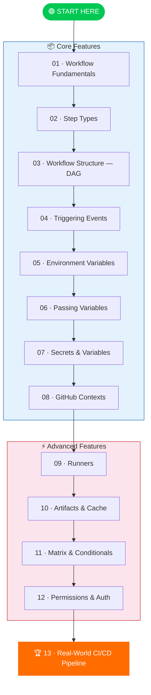
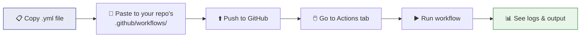

# 🚀 GitHub CI/CD — Beginner to Pro

> Learn GitHub Actions from zero to production-ready pipelines.
> Every module = **visual flow** + **runnable demo workflow**.

---

## 🗺️ Learning Roadmap

---

## 📂 Module Index

| # | Module | What You'll Learn | Demo Workflows |
|---|--------|-------------------|----------------|
| 01 | [Workflow Fundamentals](./01-workflow-fundamentals/) | workflow → job → step hierarchy | `hello-world.yml` |
| 02 | [Step Types](./02-step-types/) | Shell, scripts, marketplace actions | 3 workflows |
| 03 | [Workflow Structure — DAG](./03-workflow-structure-dag/) | Parallel jobs, `needs` keyword | `dag-demo.yml` |
| 04 | [Triggering Events](./04-triggering-events/) | Manual, push, PR, cron triggers | 4 workflows |
| 05 | [Environment Variables](./05-environment-variables/) | Scope: workflow / job / step | `env-scopes.yml` |
| 06 | [Passing Variables](./06-passing-variables/) | `GITHUB_OUTPUT`, `GITHUB_ENV`, inter-job | 3 workflows |
| 07 | [Secrets & Variables](./07-secrets-and-variables/) | Repo/org secrets, config variables | `secrets-demo.yml` |
| 08 | [GitHub Contexts](./08-github-contexts/) | `github.*`, `runner.*`, `matrix.*` | `contexts-explorer.yml` |
| 09 | [Runners](./09-runners/) | GitHub-hosted, self-hosted, 3rd-party | `multi-runner.yml` |
| 10 | [Artifacts & Cache](./10-artifacts-and-cache/) | Persist data, speed up builds | 2 workflows |
| 11 | [Matrix & Conditionals](./11-matrix-and-conditionals/) | Multi-OS × multi-version, `if`, concurrency | `matrix-demo.yml` |
| 12 | [Permissions & Auth](./12-permissions-and-auth/) | `GITHUB_TOKEN`, OIDC, external auth | `permissions-demo.yml` |
| 13 | [Real-World CI/CD](./13-real-world-ci-cd/) | Full pipeline: lint → test → build → deploy | `full-pipeline.yml` |

---

## 🧪 How to Use the Demo Workflows

> **All demos use `workflow_dispatch`** — you can trigger them manually from the GitHub Actions tab. No code changes needed!

---

## 📋 Prerequisites

- A GitHub account (free tier works)
- A GitHub repository (public or private)
- Basic YAML knowledge (indentation = structure)

---

*Built with ❤️ for DevOps engineers who learn by doing.*
